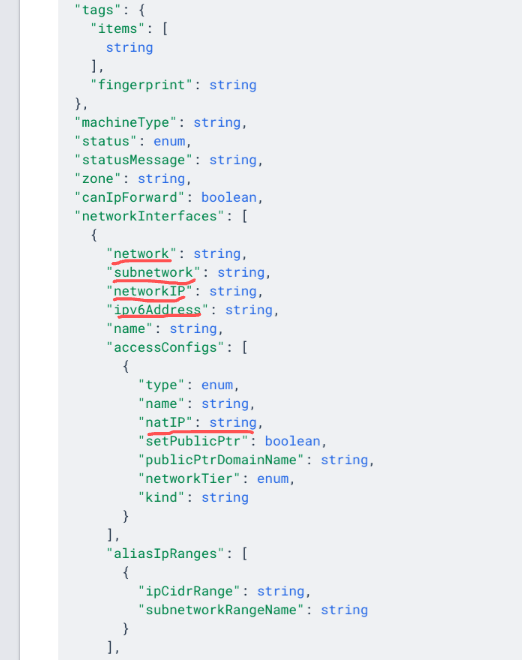

# VM Instance Network Migration
## Characteristics:
1. You can choose to preserve the external IP. If the original VM uses an Ephemeral external IP, its IP will be reserved as a static external IP after the migration.  
2. The original VM will be deleted and recreated using the modified network configuration (modified fields: network, subnetwork, natIP, networkIP). If you choose to preserve the external IP, the ‘natIP’ field won’t change.  

## Limitations:
1. The IP preservation action is not reversible, even though roll back happens.
## Special cases:
### 1. Migrate a VM instance which is a member of an instance group:
Not supported. \
The tool will terminate, and the migration will not start. \
*Recommendation*: you should [migrate that instance group](./INSTANCE_GROUP_README.md) directly.
### 2. Migrate a VM instance which is a backend serving one or more target pool:
Supported, but it is not recommended. \
The tool can migrate this VM instance. But after the migration,
the VM instance may have been removed from the target pool. 
In general, the target pool may be affected. \
*Recommendation*: [remove the VM instance from the target pool](https://cloud.google.com/compute/docs/reference/rest/v1/instanceGroupManagers/setTargetPools) and then migrate it.
### 3. Migrate a VM instance which serves a target instance:
Supported. 
    